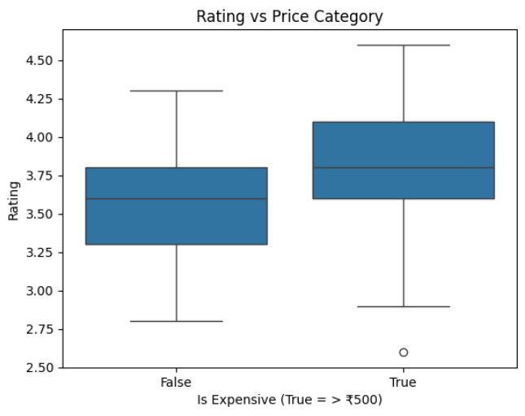
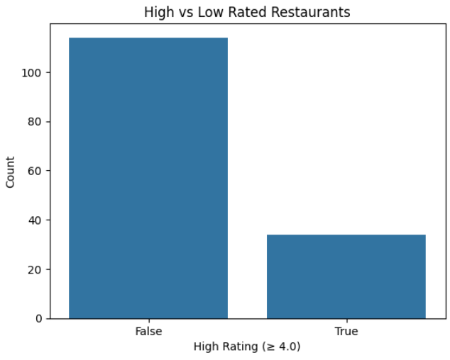
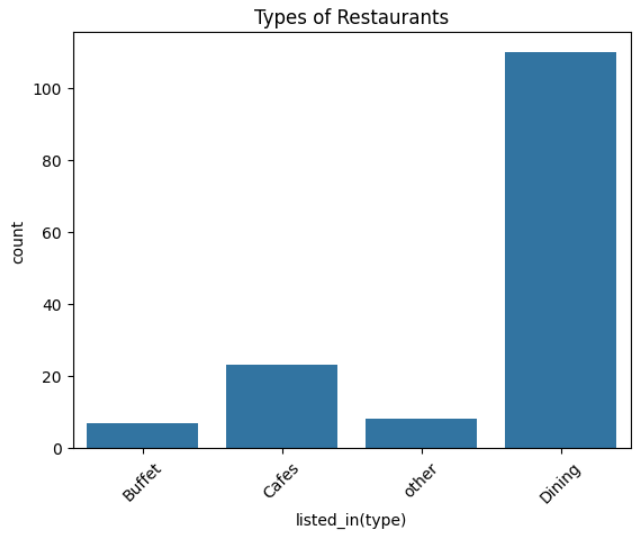
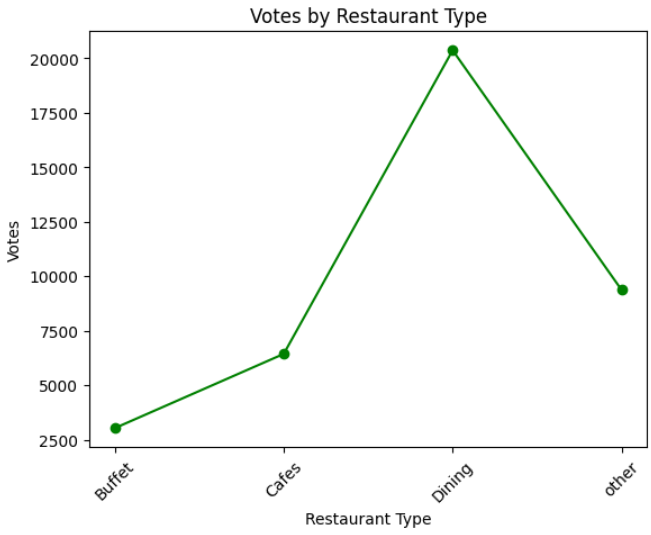
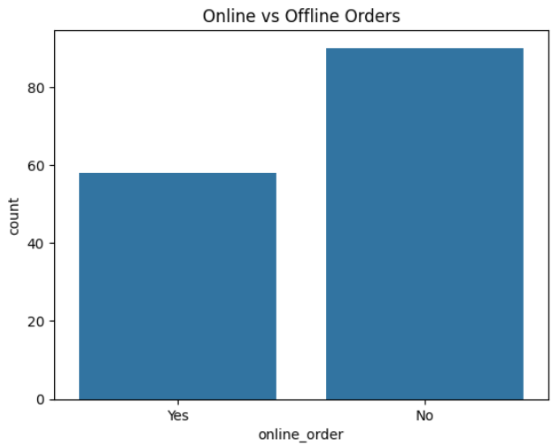
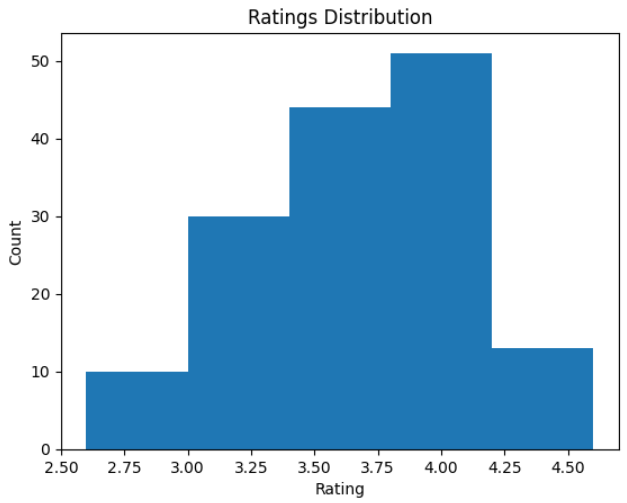
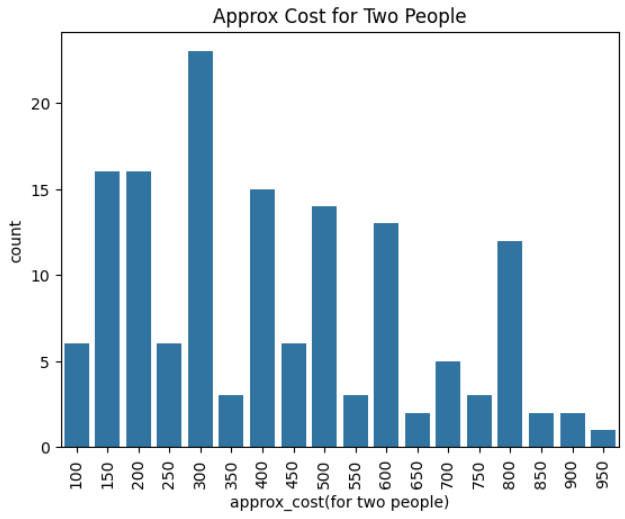
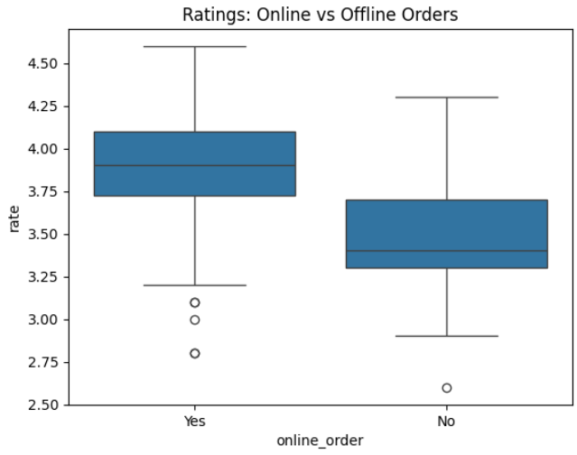
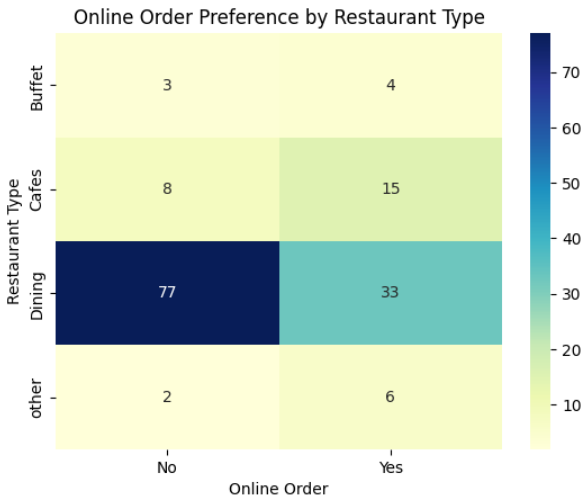

# 🍽️ Zomato Restaurant Analytics (EDA & Statistics Project)

## 📌 Project Overview
Understanding customer preferences and restaurant performance is critical for food delivery platforms.  
This project performs **Exploratory Data Analysis (EDA)** on a Zomato restaurant dataset to uncover insights related to **pricing, ratings, restaurant types, and online ordering behavior**, supported by **statistical validation**.

---

## 🎯 Objectives
- Analyze customer preferences across restaurant types  
- Study pricing trends and preferred cost ranges  
- Compare ratings for online vs offline ordering  
- Validate insights using statistical hypothesis testing  
- Generate actionable business insights for food delivery platforms  

---

## 🗂️ Dataset
- Source: Zomato restaurant dataset (`Zomato-data-.csv`)
- Size: 148 restaurant records  
- Key Features:
  - `name` - Restaurant name
  - `online_order` - Whether online ordering is available (Yes/No)
  - `book_table` - Whether table booking is available (Yes/No)
  - `rate` - Restaurant rating (cleaned from format like "4.1/5")
  - `votes` - Number of customer votes
  - `approx_cost(for two people)` - Approximate cost for two people
  - `listed_in(type)` - Restaurant type (Buffet, Cafes, Delivery, Dining)

---

## 🛠️ Tech Stack
- **Programming Language:** Python  
- **Libraries:** Pandas, NumPy, Matplotlib, Seaborn  
- **Statistics:** SciPy (Hypothesis Testing)  
- **Environment:** Jupyter Notebook / Google Colab  

---

## 🔍 Key Analysis Steps

### 1️⃣ Data Cleaning & Preprocessing
- Replaced unwanted values (`NEW`, `-`) with NaN in the `rate` column
- Extracted numeric ratings from format "X.X/5" to float values
- Filled missing ratings with the median rating
- Verified data completeness (no null values after cleaning)
- All 148 records have complete data across 7 columns

---

### 2️⃣ Exploratory Data Analysis (EDA)
- Restaurant type distribution analysis
- Online vs offline order availability
- Rating distribution and popularity trends
- Cost preference analysis for couples

---

### 3️⃣ Feature Engineering
- Created `is_expensive` feature: Boolean flag for restaurants costing > ₹500 for two
- Created `high_rating` feature: Boolean flag for restaurants with rating ≥ 4.0
- These features enable categorical analysis of pricing and quality segments

---

### 4️⃣ Statistical Hypothesis Testing
- **Test Used:** Two-sample t-test  
- **Objective:** Compare ratings of online-order vs offline restaurants  

**Results:**
- T-statistic = 6.11  
- P-value = 8.39 × 10⁻⁹  

**Conclusion:**  
Restaurants offering online ordering have **statistically significantly higher ratings** (p < 0.001).

---

## 📊 Visualizations

### 1. Rating vs Price Category (Boxplot)
Compares ratings between expensive (>₹500) and affordable (≤₹500) restaurants. Shows the distribution of ratings for each price category.

**Key Insight:** Helps identify if higher prices correlate with better ratings.

### 2. High vs Low Rated Restaurants (Count Plot)
Distribution of restaurants based on rating threshold (≥4.0 vs <4.0). 

**Key Insight:** The majority of restaurants have ratings ≥ 4.0, indicating overall good quality in the dataset.

### 3. Types of Restaurants (Count Plot)
Count of different restaurant types in the dataset (Buffet, Cafes, Delivery, Dining).

**Key Insight:** Shows which restaurant types are most common in the dataset.

### 4. Votes by Restaurant Type (Line Graph)
Total votes received by each restaurant type, showing customer engagement levels.

**Key Insight:** Identifies which restaurant types receive the most customer interaction and reviews.

### 5. Restaurant with Maximum Votes
Identifies the restaurant with the highest customer engagement by analyzing vote counts.

**Key Insight:** Shows which restaurant has the most customer reviews and engagement, indicating popularity and customer satisfaction.

- Name: Empire Restaurant
- Votes: 4884

### 6. Online vs Offline Orders Distribution
Count plot showing the distribution of restaurants offering online ordering versus offline-only service.

**Key Insight:** Reveals the adoption rate of online ordering across restaurants in the dataset.

### 7. Ratings Distribution
Histogram displaying the distribution of restaurant ratings across 5 bins.

**Key Insight:** Shows the overall quality distribution and rating patterns, helping identify the most common rating ranges.

### 8. Approximate Cost for Two People
Distribution of pricing across restaurants, showing the variety of cost ranges available.

**Key Insight:** Helps understand pricing strategies and affordability segments in the restaurant market.

### 9. Ratings: Online vs Offline Orders (Boxplot)
Comparative boxplot analysis of rating distributions between restaurants offering online orders and those that don't.

**Key Insight:** Provides visual confirmation of the statistical test, clearly showing that online-order restaurants have higher median ratings.

### 10. Online Order Preference by Restaurant Type (Heatmap)
Heatmap visualization showing the relationship between restaurant types and online ordering availability.

**Key Insight:** Identifies which restaurant types (Buffet, Cafes, Delivery, Dining) are more likely to offer online ordering services.

---

## 📈 Key Insights
- **Online ordering impact:** Restaurants with online ordering have significantly higher ratings (p < 0.001)
- **Statistical significance:** T-statistic of 6.11 with p-value of 8.39 × 10⁻⁹ confirms the difference
- **Most popular restaurant:** Empire Restaurant received the highest votes (4,884)
- **Rating distribution:** Majority of restaurants have ratings ≥ 4.0
- **Restaurant types:** Dataset includes Buffet, Cafes, Delivery, and Dining establishments
- **Price categories:** Restaurants are categorized as expensive (>₹500) or affordable (≤₹500)  

---

## 💡 Business Impact
- Helps food delivery platforms identify high-potential restaurants  
- Supports online-order adoption strategies  
- Assists restaurants in pricing and service optimization  
- Demonstrates data-driven decision-making using EDA and statistics  

---

## 🚀 Future Enhancements
- Build machine learning models for rating prediction  
- Develop a restaurant recommendation system  
- Create an interactive dashboard using Streamlit or Power BI  
- Expand analysis with larger multi-city datasets  

---
